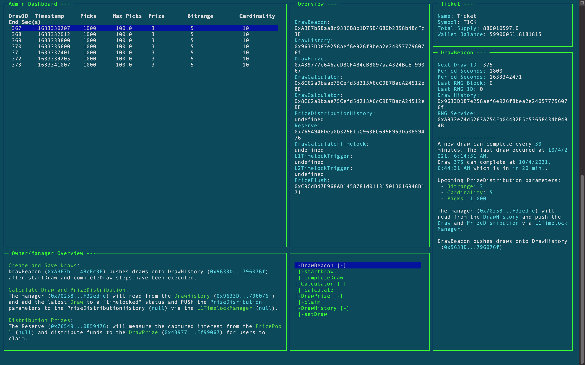

# PoolTogether V4 Mainnet
The V4 mainnet deployed contracts and essential hardhat tasks.

# Getting Started
Install `direnv` module.

We use [direnv](https://direnv.net/) to manage environment variables.  You'll likely need to install it.

```sh
cp .envrc.example .envrc
```

To run fork scripts, deploy or perform any operation with a mainnet node you will need Alchemy accounts

# Setup
```.sh
yarn
```

<p align="left">
  <a href="https://github.com/pooltogether/pooltogether--brand-assets">
    
  </a>
</p>
